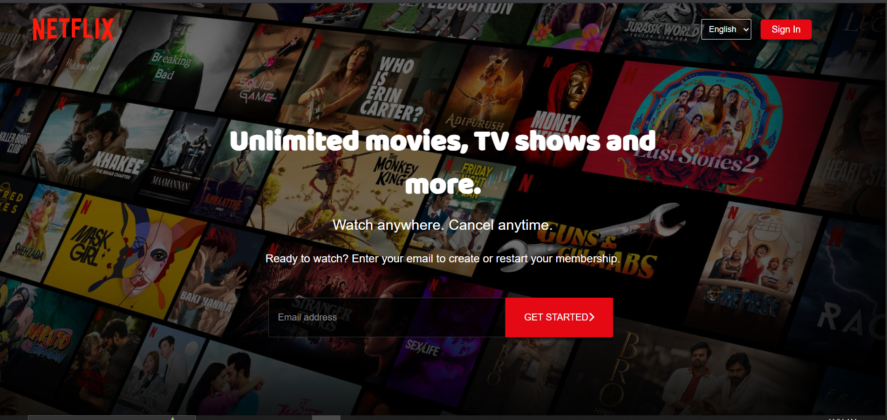

# 🎬 Netflix Clone Frontend (HTML + CSS Only)

<p align="center">
  
</p>

---

[🔗 Live Demo](https://neerajkumar151.github.io/Netflic-clone-frontend/)

A simple and elegant **Netflix landing page clone** created using pure **HTML and CSS**. This project focuses on recreating the clean design and layout of the Netflix homepage, ensuring responsiveness across devices.


---

## ✨ Features

- ✅ Pixel-perfect Netflix UI layout
- ✅ Fully responsive design for all screen sizes
- ✅ Clean code and folder structure
- ✅ Pure HTML5 and CSS3 – no JavaScript or frameworks
- ✅ GitHub Pages deployed

---

## 🧑‍💻 Tech Stack

| Technology | Description              |
|------------|--------------------------|
| HTML5      | Markup structure         |
| CSS3       | Styling and responsiveness |
| GitHub Pages | For deployment         |

---

## 📂 Folder Structure

Netflic-clone-frontend/
│
├── index.html # Main page
├── style.css # All CSS styles
├── assets/ # Logos and images
└── README.md # Project documentation


---

## 🚀 How to Run Locally

1. **Clone the repository**  
```bash
git clone https://github.com/Neerajkumar151/Netflic-clone-frontend.git
cd Netflic-clone-frontend
```
---

## 🌍 Deployment

This project is hosted on **GitHub Pages**  
🔗 [Click to Visit](https://neerajkumar151.github.io/Netflic-clone-frontend/)

---

## 🔮 Future Plans

- Add interactivity with JavaScript  
- Use movie data via TMDB API  
- Build a complete Netflix clone using React  
- Add login/authentication in future versions  

---

## 🙋‍♂️ About Me

**Neeraj Kumar**  
🎓 Final Year B.Tech IT Student  
🏫 GL Bajaj Institute of Technology & Management, Greater Noida  
🌐 [GitHub Profile](https://github.com/Neerajkumar151)

---

## ⭐ Show Some Love

If you like this project:

- ⭐ Star the repo  
- 📌 Share it  
- 📥 Fork it  
- 💡 Contribute your ideas  

---

## 📄 License

This project is licensed under the [MIT License](https://opensource.org/licenses/MIT).

